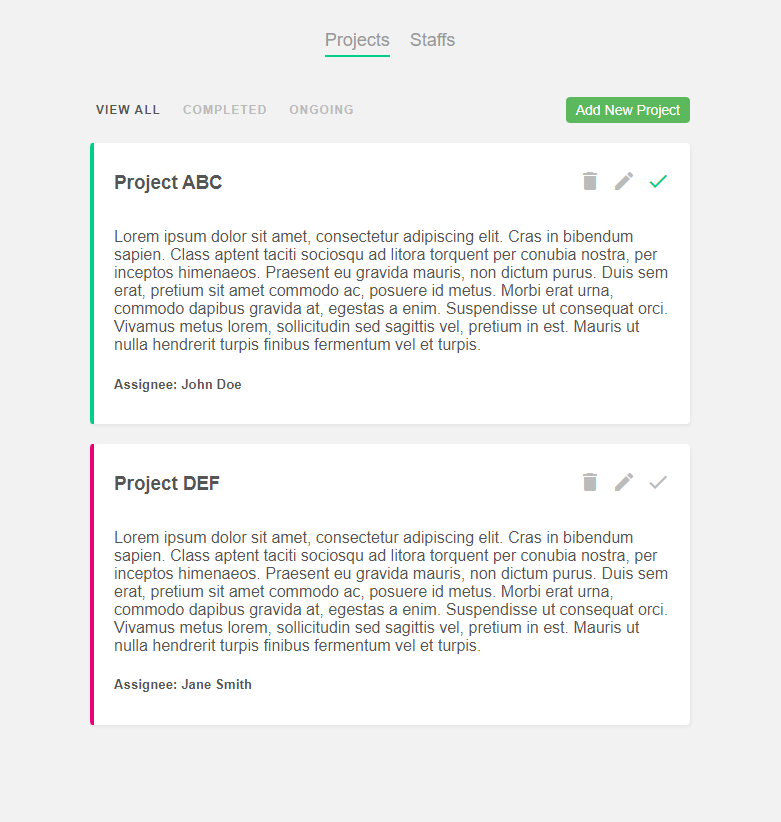

# Project Planner

A project planner made to help manage and track projects



### Installation

First, clone the repository to your local machine:

```
  git clone https://github.com/aizatnazran/project-planner.git
```

## Run Locally

Go to the project directory

```bash
  cd project-planner
```

Install dependencies

```bash
  npm install
```

Set up the local database

```bash
  cp data/db.json.example data/db.json
```

Start the JSON server

```bash
  npm run json-server
```

Serve the application on a local development server

```bash
  npm run serve
```


